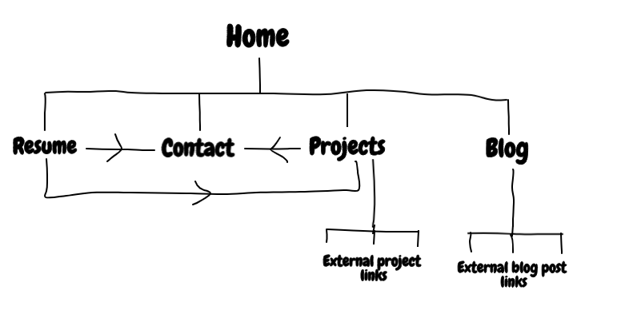

# Thomas Haysom - Porfolio and Blog Website

A professional and personalized, fully responsive mobile first website:

* including a landing page which displays overview of entire site and a prominent user call to action.
* displaying the owner's (my) resume (work history, education, skills, qualifications).
* presenting and linking to my coding projects on github.com.
* presenting and linking to my blog posts on medium.com.
* providing links to my professional social media accounts.
* displaying a simple contact form with my contact details.
* providing a link to download a pdf copy of my resume.

### Link to live site

[Link to live site](https://thaysom22.github.io/portfolio_project/) hosted by GitHub pages.

### Owner's goals

The owner's (my) goals for the site:

* to present my skills, experience, qualifications and abilities in a clear, convenient, professional format to potential
employers and clients. 
* to provide a clear, positive and satisfying user interface and experience to all users of the site and help establish a positive reputation for myself as
a developer and web designer with front end skills.
* to provide a convenient way for potential employers/clients/collaborators/developers to contact me so that I increase job opportunities, expand my network and  industry connections.
* to present my projects to potential colaborators and other developers so I increase my following and connections and receive more feedback and suggestions.
* to present a selection of my blog posts primarily to other developers with a similar level of skills
and experience to me so that I contribute in a small way to help others learn and grow and I benefit myself 
through comments and interactions.
* to evidence my accomplished communication and design skills so I am more likely to be hired or recommended for projects. 

This site facilitates the realisation of these owner's goals better than alternatives by:

* displaying relevant information to users while simultaneously showcasing my design and front-end development skills.
* collating all aspects of my professional online presence and directing users on clear paths to relevant information through efficient navigation.
* providing a richer, more engaging, more personalized exposition of my professional credentials, interests and personality than 
a proforma resume hosting site or document.

### User goals

The goals of various site users are:

* potential employer/client looking to hire a junior developer - wants to assess my skills and experience
quickly, get an impression of my ability and areas of strength/weakness, find relevant information about 
qualifications, view my projects and contact me easily.
* potential collaborator looking to work with a junior developer with relevant skills and experience to their needs -
wants to assess my skills and experience quickly, view my previous projects and contact me easily.
* coding student/learner/enthusiast looking for blog posts relevant to their experience and knowledge levels - 
wants to choose from and view my blog posts easily.
* other developers who may want to follow me on GitHub or otherwise connect - want to view a summary of my projects
and link to them easily on GitHub: may also want to contact me to connect. 

This site facilitates the realisation of these various user's goals better than alternatives by:

* providing a simple, intuitive user interface that facilatiates easy navigation to desired content.
* separating resume, projects and blog features of site to avoid overloading users with information and 
encapsulating what is relevant to them.
* providing easy to find, clear and standardized contact information.

## UX

User stories:

* A potential employer/client/collaborator: wants to find out about my qualifications, experience and 
previous projects, and contact me if necessary, so they can conveniently evaluate my skill level and knowledge 
relative to the needs of their organization/project. 
* A potential client/collaborator: wishes to view the nature and quality of my projects, and contact me or to connect
with me online so they can make an proposal/enquiry about a job/project.
* A coding student/learner/enthusiast: wants to browse and read my blog posts and view my projects to potentially learn more 
about a topic that interests them, or get ideas/reflections from someone in a similar situation, with similar career goals.  

# Thomas Haysom - Porfolio and Blog Website

A professional and personalized, fully responsive mobile first website:

* including a landing page which displays overview of entire site and a prominent user call to action.
* displaying the owner's (my) resume (work history, education, skills, qualifications).
* presenting and linking to my coding projects on github.com.
* presenting and linking to my blog posts on medium.com.
* providing links to my professional social media accounts.
* displaying a simple contact form with my contact details.
* providing a link to download a pdf copy of my resume.

### Link to live site

[Link to live site](https://thaysom22.github.io/portfolio_project/) hosted by GitHub pages.

### Owner's goals

The owner's (my) goals for the site:

* to present my skills, experience, qualifications and abilities in a clear, convenient, professional format to potential
employers and clients. 
* to provide a clear, positive and satisfying user interface and experience to all users of the site and help establish a positive reputation for myself as
a developer and web designer with front end skills.
* to provide a convenient way for potential employers/clients/collaborators/developers to contact me so that I increase job opportunities, expand my network and  industry connections.
* to present my projects to potential colaborators and other developers so I increase my following and connections and receive more feedback and suggestions.
* to present a selection of my blog posts primarily to other developers with a similar level of skills
and experience to me so that I contribute in a small way to help others learn and grow and I benefit myself 
through comments and interactions.
* to evidence my accomplished communication and design skills so I am more likely to be hired or recommended for projects. 

This site facilitates the realisation of these owner's goals better than alternatives by:

* displaying relevant information to users while simultaneously showcasing my design and front-end development skills.
* collating all aspects of my professional online presence and directing users on clear paths to relevant information through efficient navigation.
* providing a richer, more engaging, more personalized exposition of my professional credentials, interests and personality than 
a proforma resume hosting site or document.

### User goals

The goals of various site users are:

* potential employer/client looking to hire a junior developer - wants to assess my skills and experience
quickly, get an impression of my ability and areas of strength/weakness, find relevant information about 
qualifications, view my projects and contact me easily.
* potential collaborator looking to work with a junior developer with relevant skills and experience to their needs -
wants to assess my skills and experience quickly, view my previous projects and contact me easily.
* coding student/learner/enthusiast looking for blog posts relevant to their experience and knowledge levels - 
wants to choose from and view my blog posts easily.
* other developers who may want to follow me on GitHub or otherwise connect - want to view a summary of my projects
and link to them easily on GitHub: may also want to contact me to connect. 

This site facilitates the realisation of these various user's goals better than alternatives by:

* providing a simple, intuitive user interface that facilatiates easy navigation to desired content.
* separating resume, projects and blog features of site to avoid overloading users with information and 
encapsulating what is relevant to them.
* providing easy to find, clear and standardized contact information.

## UX

User stories ('As user_type I want to achieve X by doing Y'):

* As a potential employer/client/collaborator I want to find out about site owner's qualifications, experience and interests by viewing an online resume.
* As a potential employer/client/collaborator I want to obtain a copy of site owner's resume by clicking a download link.
* As a potential employer/client/collaborator I want to view site owner's previous projects and evaluate his skill and experience by linking to relevant GitHub repositories.
* As a potential employer/client/collaborator I want to contact the site owner, to make a proposal/enquiry about a job/project or ask a general question, by completing a simple online form.
* As a potential employer/client/collaborator I want to read the site owner's blog, to assess his interets and communciation skills, by selecting from a display of links to posts.
* As a potential employer/client/collaborator I want to view a specific proffesional profile of the owner by selecting from links to popular recruitment/bloging/code hosting sites.
* As a coding student/learner/enthusiast I want to read owner's blog posts, to learn more about topics that interest me and get ideas and inspiration, by browsing a selection of sample links to full posts.
* As a coding student/learner/enthusiast I want to view owner's projects, to learn and get ideas, by browsing a selection of sample links to GitHub repositories.
* As a coding student/learner/enthusiast I want to make contact with the owner to discuss ideas, resources or make connections; by completing a simple online form.
* As a developer/other professional contact I want to quickly find owner's work history and education by navigating to a clear online summary.
* As a developer/other professional contact I want to easily find owner's contact details by navigating to contact area of site.
* As any of the above user types I want to generally find out more about the owner as a developer by being directed to relevant and categorized information about him.

### Links to wireframe mockups

[Wireframes for all pages](portfolio_project_wireframes.pdf) (pdf)

## Features

### Site map (navigation overview)

* All pages navigate to all other pages directly through navigation links in fixed header. 
* All pages navigate to external (Medium, GitHub, Linkedin) links via footer. 
* Home and resume pages include link to download resume.pdf file.
* Blog and projects pages contain numerous external links to individual posts and project repositories.

### Features across whole site

* [Header](index.html) - fixed height and fixed to top of viewport over other content on all pages and view sizes. Includes familiar top left site logo which links back to index.html and top right responsive navigation menu. 
Navigation menu includes links to Home, Projects, Blog and Resume pages; and a Contact button that opens a modal containing a contact form (described below).
All navigation links (except logo icon) provide user feedback: a background-color transition hover effect and a boxshadow active effect when pressed/clicked.
Current page (active link) has a bold font to remind the user of their current location on the site.
Navigation links in responsive navbar occupy right half of header area on desktop views, 66% on tablet views and collapse into a familiar top right 'hamburger' menu button with remaining adjacent contact link on mobile device sizes. Link heights scales subtly with viewport width on desktop views.
Hamburger menu drops down at top right of area below header when icon is pressed - dropdown menu contains links to Home, Projects, Blog and Resume pages which are styled consistently and provide consistent user feedback. 
Header provides a familiar and comfortable navigation experience to users and reassuring feedback when using navigation. Header allows user to reach all areas of site very easily for anywhere on the site.

* [Contact modal](index.html) - triggered by clicking/pressing Contact button that is present at top right of header on all view sizes. 
Modal content starts beneath header and all of page content is covered by grayscale overlay, all page content (except header) is blurred.
Modal is scrollable and cannot be closed by clicking outside modal. 
Modal contains a header: with a 'contact me' title and a 'x' icon button (with scale up hover effect) to dismiss and close the modal which returns user to the page from which the modal was opened. 
Modal contains a body: with a form containing 5 input fields (first name, last name, email, phonenumber and message) which are labelled by placeholder text. First name, last name and email are required fields. There is client-side verification of phone number and email format using regex. 
Form has a submit button which triggers pop-ups next to input fields if requirements of form are not met, or if form meets requirements it triggers a browser alert to confirm form was usbmitted successfully and reloads page that modal was opened from. Sumbit button has a scale up hover effect and a box shadow active effect.
Modal has a footer containing location and email contact information for site owner.
Modal has a responsive layout - positioning of short input fields adjusts from single column on mobile to two column on desktop. Width of message input field increases with viewport width. 

* [Footer](index.html) - fixed height on all pages and view sizes. Dark background and smaller white font used to provide contrast and to visually identify 'aside' information.
Footer contains brief summary of location and copyright information at bottom left (serves as an 'about me'). 
Footer contains recognizable icon links to owner's Medium, GitHub and LinkedIn profiles so user can easily view specific parts of owner's online presence. These links have a background-color transition hover effect.

### Home (landing page) 

* [Hero image section](index.html) - engaging large background image with subtle zoom in transition to encourage a positive first visual impression and emotional response.
Image is styled responsively so that the most important central part of the image is always visible and centered, without stretching or loss of quality on all device sizes. 
Hero image has a responsive jumbotron overlay with a brief headline and large call to action link 'Get to know me' which is anchored to main section of the homepage below.
Call to action provides direction for users who are more generally interested in finding out more about the owner, ratehr than looking for a specific thing. 
Call to action button is bold, has high contrast and scales up noticeably on hover to encourage user action. 
Jumbotron box size and font sizes scale change at specific view port width so that content remains prominent on all device sizes. 
Position, background and color of jumbrotron changes when viewport width reaches orginal width of hero image and starts to zoom. 
Jumbotron is positioned at bottom of hero image on smaller below this point (against darker part of image for contrast) and changes to a speech bubble design at top left of image (with dark text and white background) after this point.
User is drawn intially to jumbotron on all display sizes as a result. 

* [About me heading](index.html) - three bold headlines to provide user with high level, easy to digest information about me. Consistent high contrast colors, styling and layout on all device sizes. 

* [Main sections of homepage](index.html) - this section is anchored from the call to action button in jumbotron above. Provides a brief summary of each of the main areas of the site (projects, blog, resume) and a link to each as a button styled with bold effects similar to the jumbotron CTA button.
Resume subsection also includes a [link to download a pdf](index.html) of my resume so this option is easily accessible on the homepage for any users who have this specific goal. 
Layout of this section changes from three full-width subsections in one column on mobile view, to one fixed-width column with a surrounding border on tablet, to a one row layout with relevant images added and a border around each subsection on larger displays. 
This responsive layout design makes good use of available space and ensures each section in always clearly delineated and easy to find.

### Blog

* [Heading](blog.html) - a full width heading box at the top of page with a title containing relevant icon and contrasting colors. Gives clear feedback to user where they are on the site and what the contents of the page will be. 
* [Main section](blog.html) - contains external links to individual blog posts (open in new tab). Each link is a relevant background image, short summary and title. Each link has a scale up hover effect to provide user with a focus on the post they are considering. 
Layout of links to blog posts is responsive: one column full width with spacing horizonal dividers on mobile view; 2 column with a border around each link and space around each link on small tablets, 3 column on large tablets and 4 column on desktop. 
User is able to comfortably browse all blog post topics and select to open those in which thet are interested. 

### Projects

* [Heading](projects.html) - a full width heading box at the top of page with a title containing relevant icon and contrasting colors. Gives clear feedback to user where they are on the site and what the contents of the page will be. 
* [Main section](projects.html) - contains external links to individual project repositories (open in new tab). Each link is a relevant background image, short summary and title. Each link has a scale up hover effect to provide user with a focus on the project they are considering. 
Layout of links to projects is responsive: one column full width with spacing horizonal dividers on mobile view; 2 column with a border around each link and space around each link on small tablets, 3 column on large tablets and 4 column on desktop. 
User is able to comfortably browse all of owner's projects and select to open those in which thet are interested. 

### Resume

* ['Executive summary' heading](resume.html) - three bold headlines to provide user with further high level, easy to digest information about me; since if they have navigated to this page they are interested in my credentials.Consistent high contrast colors, styling and layout on all device sizes. 
* ['Download my resume' link](resume.html) (as on homepage) clearly positioned near top of page and easily accessible for any users who require my resume in this format. 
* [Work history section and qualification sections](resume.html) provide clear and concise dates, employer information and descriptions of roles in a reverse-chronological timeline format so users can easily digest information. 
Each section of page (work history, qualifications, skills, about me) has a full width heading box at the top of page with a title containing relevant icon and consistent, contrasting colors. Gives clear feedback to user to find information on the page.
Information is prioritzed and easy for user to find: educational qualifications are displayed first followed by a summary of owner's skills and knowledge of specific technologies as a software developer and a more casual 'about me' section conatining owner's interests, hobbies and achievements and a consistent avatar image displayed.
Sections have a responsive layout to maximize use of available horizontal space and provide more information on viewport where possible. All sections are full width, single column and stacked vertically on mobile views. The employment and qualification sections change to a two column layout on tablet views (each with a border) while skills and about me sections remain full width (but the arrangment of elements within these sections changes to accommodate extra space).
On desktop views the skills section becomes an extra column adjacent to the employments and qualifications section while the about me section remains full width at the bottom of the page (since it has lowest priority).   

### Features left to implement in future:

* Internal blog post pages
* Backend for form

## Technologies Used

Languages used.
Frameworks used. 
Libraries used.
Other tools (wireframing, images, fonts, colors, code validation, documentation) - provide link and how/why used.

## Testing

[Link to TESTING.md file]("TESTING.md")

## Deployment

Describe fully the process followed using GitHub pages
Detail any differences between development version and deployed version (branch differences)
Describe how to run code locally

## Credits and acknowledgements

### Content

Bootstrap templates used (and adapted)?

### Media

Images hosting sites (Unsplash)

### Code

(Code also commented directly)

### Acknowledgements

StackOverflow
Slack community 
Book?
Mentor
Code Institute template for README
AnnaG README.md file from MS1 project example for README template guide
[websitedimensions.com](https://www.websitedimensions.com/)
[appledeveloper.com docs](https://developer.apple.com/library/archive/documentation/DeviceInformation/Reference/iOSDeviceCompatibility/Displays/Displays.html)
* Bootstrap - stackpath CDN
* Bootstrap docs
* Font awesome
* w3schools.com
* coolors.co - color palette picker
* Unsplash - Cookie the Pom
* pixlr.com image editing software
* hover.css (hvr-grow animation - css class properties copied directly)
* Google fonts
### Links to wireframe mockups

[Wireframes for all pages](portfolio_project_wireframes.pdf) (pdf)

## Features

### Site map

### Across site

* Header - including responsive navigation menu and site logo. Allows all users to navigate easily, consistenly and quickly
between different pages on the site by having clear, semantic menu options laid out in a standardized, predictable way. 
Provides a nice way for user to easily return to home page if 'lost' by clicking the ubiquitous, persoanlized logo link.
Responsive by collapsing into a menu button on smaller device sizes - so that content and functionality of navigation 
menu is consistent across different viewport widths and all users have a similar experience. 
* Footer - including repeated navigation menu links/site map links and social media links. Allows users to navigate once they have
scrolled through the main page content without needing to scroll back up. Provides external links in an easy to find
location: intuitively expected by users due to web conventions. 

### Home (landing page) 

* Hero image. Engaging and relevant large background image to encourage user to explore further by scrolling down and provide a
pleasant first visual impression. 
* About me section. Provides a succinct overview of my background, skills, experience and interests so users can quickly 
gather bitesize summary of information on site. Includes 'Call to Action' (CTA) buttons linking to project, blog post and resume pages.

### Blog

* Short summary at top of page to summarise topics and style and guide users.
* Title, image and brief description of each article for users to guage interest. Link to full post hosted internally/externally. 
* Users can scroll down to view more articles. 
* Responsive grid layout which can be further populated with future posts. 

### Resume

* Photo of me to familiarize users
* Timeline of my work history for users to evaulate
* Timeline of my educational history for users to evaluate
* Summary of my relative skills in various languages and frameworks
* CTA link to projects page
* CTA link to contact me page

### Projects

* Short summary listing the types of projects I have worked on
* CTA link to contact me page if users have questions, suggestions or wish to collaborate
* Grid layout of project summaries with short description, relevant image and external link to repo and/or live project.
* Responsive grid layout which can be further populated with future project summaries.

### Contact me

* Form for users to contact me easily.
* Name, email, subject, text area elements. 
* Alternative contact information

Existing features - how do they help user's achieve their goals, what is their purpose.

Explain scope/structure decisions made in choice and design of features. 

Features left to implement in future:

* Internal blog post pages
* Backend for form

## Technologies Used

Languages used.
Frameworks used. 
Libraries used.
Other tools (wireframing, images, fonts, colors, code validation, documentation) - provide link and how/why used.

## Testing

Link to separate TESTING.md file 

## Deployment

Describe fully the process followed using GitHub pages
Detail any differences between development version and deployed version (branch differences)
Describe how to run code locally

## Credits and acknowledgements

### Content

Bootstrap templates used (and adapted)?

### Media

Images hosting sites (Unsplash)

### Code

(Code also commented directly)

### Acknowledgements

StackOverflow
Slack community 
Book?
Mentor
Code Institute template for README
AnnaG README.md file from MS1 project example for README template guide
[websitedimensions.com](https://www.websitedimensions.com/)
[appledeveloper.com docs](https://developer.apple.com/library/archive/documentation/DeviceInformation/Reference/iOSDeviceCompatibility/Displays/Displays.html)
* Bootstrap - stackpath CDN
* Bootstrap docs
* Font awesome
* w3schools.com
* coolors.co - color palette picker
* Unsplash - Cookie the Pom
* pixlr.com image editing software
* hover.css (hvr-grow animation - css class properties copied directly)
* Google fonts